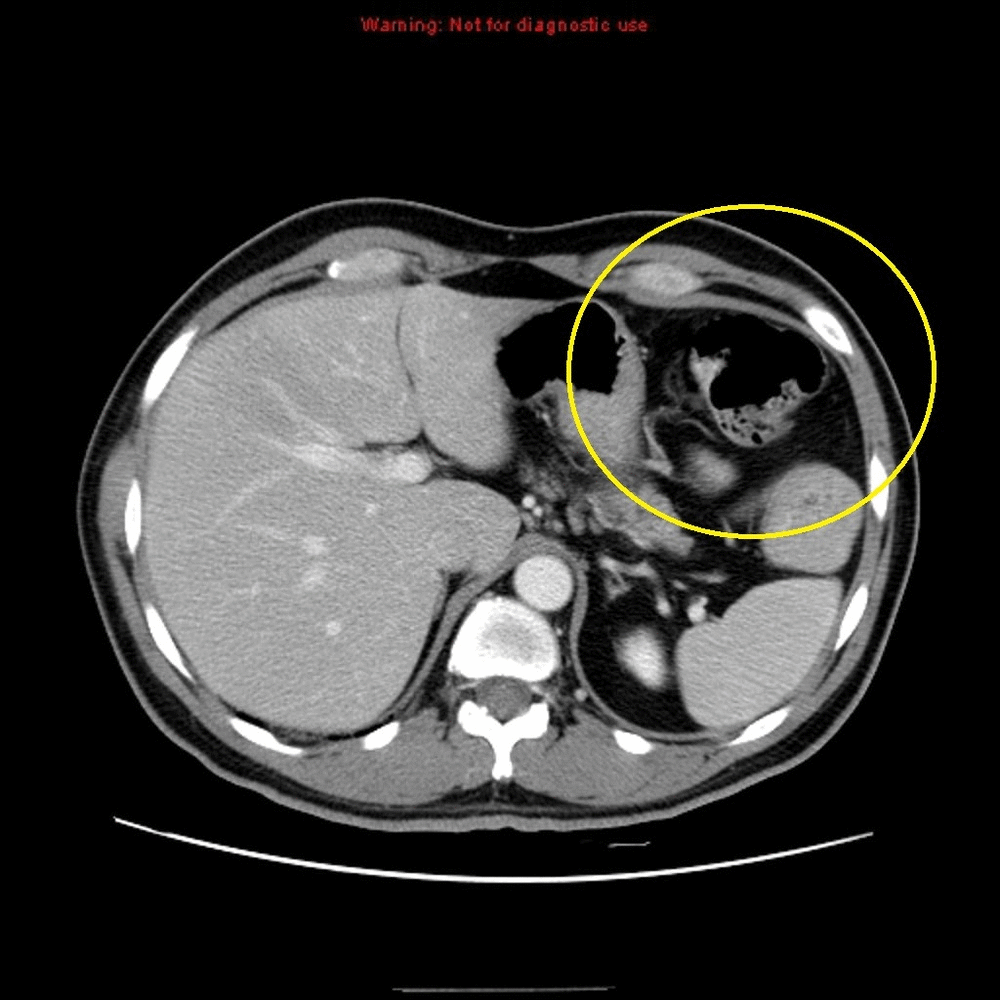

## Portfolio

---

## Classical and Neural-Net based Computer Vision

[Lane Detection and Turn Prediction](/Lane_detect.md)

---
[Cancer Detection using CNN](https://nbviewer.org/github/Noor1886/Skin-cancer-detection/blob/main/Detection_of_Malignant_Skin_Cancer_using_a_CNN.ipynb)

---
## Robotics and NLP

- [Sentiment Analysis using NLTK and Transformers](http://example.com/)

- [Robot Dog Simulation](/robo_dog.md)
  

- [Motion Predictor using Machine Learning](http://example.com/)

---

---

Page template forked from <a href="https://github.com/evanca/quick-portfolio">evanca</a>

<!-- Remove above link if you don't want to attibute -->
