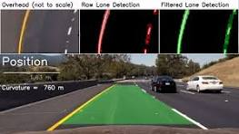
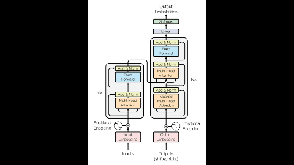
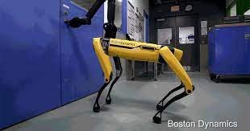
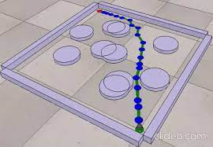

## Portfolio

---

### Classical and Neural-Net based Computer Vision

[Lane Detection and Turn Prediction](/Lane_detect.md)

  

[Cancer Detection using CNN](https://nbviewer.org/github/Noor1886/Skin-cancer-detection/blob/main/Detection_of_Malignant_Skin_Cancer_using_a_CNN.ipynb)

  

---

### Robotics and NLP

- [Sentiment Analysis using NLTK and Transformers](https://nbviewer.org/github/Noor1886/Sentiment-Analysis-NLP/blob/main/Sentiment_Analysis_Transformers.ipynb)

  

- [Robot Dog Simulation](/robo_dog.md)

  

- [Motion Predictor using Machine Learning](/motion_predictor.md)

  

---

